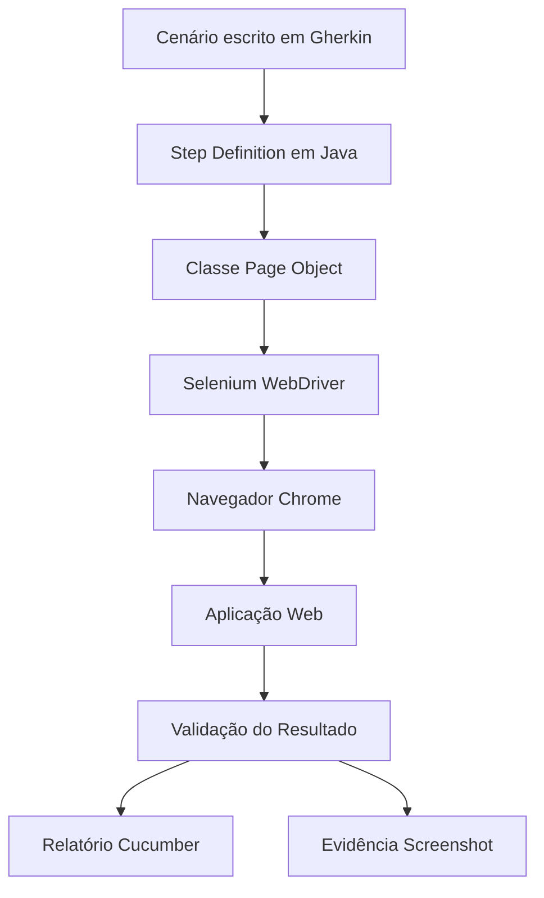

# Selenium E-commerce Automation — Modo Avançado

<p align="center">
  
  
  
  
  
  
</p>

<p align="center">
  Projeto de automação de testes web em modo avançado, desenvolvido com Selenium WebDriver, Java, Cucumber, JUnit e Maven.
</p>

---

## Sobre o Projeto

O **Selenium E-commerce Automation — Modo Avançado** é um projeto de automação de testes web desenvolvido para validar fluxos funcionais de uma aplicação de e-commerce.

A automação foi construída utilizando **Selenium WebDriver** como principal ferramenta de interação com a interface web, junto com **Java**, **Cucumber**, **JUnit 4** e **Maven**.

O projeto aplica boas práticas de QA, como:

- escrita de cenários em **Gherkin**;
- organização do código com **Page Object**;
- separação entre pages, steps, runners e support;
- execução por tags;
- geração de relatórios;
- captura de evidências;
- integração contínua com **GitHub Actions**.

---

## Descrição Curta

Projeto de automação de testes web em modo avançado, com foco em Selenium WebDriver, desenvolvido para validar fluxos de login, cadastro de usuário e compra de produto em uma aplicação e-commerce.

---

## Objetivo do Projeto

O objetivo deste projeto é demonstrar conhecimentos práticos em **Quality Assurance** e **automação de testes web**, simulando fluxos reais de uma aplicação de compra de produtos.

Com esse projeto, é possível praticar:

- automação web com Selenium WebDriver;
- escrita de cenários em Gherkin;
- uso do Cucumber com Java;
- execução de testes com JUnit;
- organização do projeto com Maven;
- uso do padrão Page Object;
- validação de mensagens em tela;
- execução de testes por tags;
- geração de relatórios com Cucumber;
- geração de relatório com Cluecumber;
- captura de screenshots como evidência;
- execução automatizada em pipeline com GitHub Actions.

---

## Funcionalidades Automatizadas

### Login

Valida o fluxo de autenticação do usuário na aplicação.

Cenários cobertos:

- login com sucesso;
- login com e-mail inválido;
- login com e-mail vazio;
- login com senha inválida;
- login com senha vazia.

---

### Cadastro de Usuário

Valida o fluxo de cadastro de um novo usuário na aplicação.

Cenário coberto:

- cadastro de usuário com sucesso.

---

### Compra de Produto

Valida o fluxo de compra dentro da aplicação após o usuário estar logado.

Cenários cobertos:

- compra realizada com sucesso;
- validação de produto adicionado ao carrinho.

Fluxo principal:

1. Realizar login na aplicação.
2. Acessar a lista de produtos.
3. Selecionar um produto.
4. Adicionar o produto ao carrinho.
5. Finalizar a compra.
6. Validar mensagem de compra realizada com sucesso.

---

## Tecnologias Utilizadas

| Tecnologia | Finalidade |
|---|---|
| Java 26 | Linguagem utilizada no projeto |
| Selenium WebDriver 4.44.0 | Automação da interface web |
| Cucumber 7.34.4 | Escrita e execução dos cenários BDD |
| JUnit 4.13.2 | Execução dos testes automatizados |
| Maven | Gerenciamento de dependências e build |
| Gherkin | Linguagem dos cenários de teste |
| Selenium Manager | Gerenciamento automático do driver |
| GitHub Actions | Execução dos testes em pipeline |
| Cluecumber Report | Geração de relatório HTML |
| Git/GitHub | Versionamento e hospedagem do código |

---

## Estrutura do Projeto

```text
selenium-webdriver-tests/
│
├── .github/
│   └── workflows/
│       └── testes-automatizados.yml
│
├── src/
│   └── test/
│       ├── java/
│       │   ├── pages/
│       │   │   ├── CadastroUsuarioPage.java
│       │   │   ├── CompraPage.java
│       │   │   └── LoginPage.java
│       │   │
│       │   ├── runner/
│       │   │   ├── RunBase.java
│       │   │   └── RunCucumber.java
│       │   │
│       │   ├── steps/
│       │   │   ├── CadastroUsuarioSteps.java
│       │   │   ├── CompraSteps.java
│       │   │   └── LoginSteps.java
│       │   │
│       │   └── support/
│       │       ├── Commands.java
│       │       ├── ScreenshotUtils.java
│       │       └── Utils.java
│       │
│       └── resources/
│           └── features/
│               ├── cadastro_usuario.feature
│               ├── compra.feature
│               └── login.feature
│
├── target/
│   ├── reports/
│   │   ├── cucumber-html-report.html
│   │   └── cucumberTests.json
│   │
│   └── cluecumber-report/
│
├── .gitignore
├── pom.xml
└── README.md
```

---

## Descrição dos Principais Arquivos

### `pom.xml`

Arquivo de configuração do Maven.

Ele contém as dependências e plugins utilizados no projeto, como:

- Selenium WebDriver;
- Cucumber Java;
- Cucumber JUnit;
- JUnit 4;
- Maven Compiler Plugin;
- Maven Surefire Plugin;
- Cluecumber Report Plugin.

---

### `src/test/resources/features/login.feature`

Arquivo responsável pelos cenários de teste da funcionalidade de login.

Contém cenários para login com sucesso e validações de dados inválidos.

---

### `src/test/resources/features/cadastro_usuario.feature`

Arquivo responsável pelo cenário de cadastro de usuário.

Valida se um novo usuário pode ser cadastrado com sucesso na aplicação.

---

### `src/test/resources/features/compra.feature`

Arquivo responsável pelos cenários de compra de produto.

Valida o fluxo completo de compra e também a exibição do produto no carrinho.

---

### `src/test/java/pages/`

Pasta responsável por armazenar as classes de Page Object.

Cada classe representa uma tela ou fluxo da aplicação:

- `LoginPage.java`;
- `CadastroUsuarioPage.java`;
- `CompraPage.java`.

As classes Page Object centralizam os elementos da tela e as ações realizadas em cada página.

---

### `src/test/java/steps/`

Pasta responsável por armazenar as classes de steps do Cucumber.

Essas classes fazem a ligação entre os cenários escritos em Gherkin e os métodos Java.

Arquivos presentes:

- `LoginSteps.java`;
- `CadastroUsuarioSteps.java`;
- `CompraSteps.java`.

---

### `src/test/java/runner/`

Pasta responsável pelas classes de execução dos testes.

Arquivos presentes:

- `RunBase.java`;
- `RunCucumber.java`.

Essas classes configuram a execução dos testes automatizados com Cucumber e JUnit.

---

### `src/test/java/support/`

Pasta com classes de apoio ao projeto.

Arquivos presentes:

- `Commands.java`;
- `ScreenshotUtils.java`;
- `Utils.java`.

Essas classes auxiliam em comandos reutilizáveis, captura de evidências e funções comuns para os testes.

---

## Cenários de Teste

### Login

```gherkin
# language: pt

@login
Funcionalidade: Login
  Eu como usuário do sistema
  Quero fazer login
  Para fazer uma compra no site

  Contexto: Acessar tela de Login
    Dado que estou na tela de login

  @login-sucesso
  Cenário: Login com sucesso
    Quando preencho login "matheus.finotti@qazando.com" e senha "123456"
    E clico em Login
    Então vejo mensagem de login com sucesso

  @login-invalido
  Esquema do Cenario: Validar "<name>"
    Quando preencho login "<user>" e senha "<password>"
    E clico em Login
    Então vejo mensagem "<message>" de campo não preenchido

    Exemplos:
      | user                        | password | message          | name            |
      | matheus.finotti.com         | 123456   | E-mail inválido. | E-mail inválido |
      |                             | 123456   | E-mail inválido. | E-mail vazio    |
      | matheus.finotti@qazando.com | 374554   | Senha inválida.  | Senha inválido  |
      | matheus.finotti@qazando.com |          | Senha inválida.  | Senha Vazia     |
```

---

### Cadastro de Usuário

```gherkin
# language: pt

@cadastro_de_usuario
Funcionalidade: Cadastro de usuário
  Eu como usuário do sistema
  Quero me cadastrar
  Para finalizar uma compra no site

  @cadastro_usuario_sucesso
  Cenário: Cadastro de usuário com sucesso
    Dado que estou na tela de cadastro de usuário
    E preencho todos os campos obrigatórios
    Quando clico em cadastrar
    Então vejo mensagem de usuário cadastrado com sucesso
```

---

### Compra de Produto

```gherkin
# language: pt

@compra
Funcionalidade: Compra de produto
  Eu como usuário logado
  Quero selecionar um produto
  Para realizar uma compra no site

  Contexto: Usuário logado na aplicação
    Dado que estou logado na aplicação com user "matheus.finotti@qazando.com" e senha "123456"

  @compra-sucesso
  Cenário: Compra realizada com sucesso
    Quando acesso a lista de produtos
    E seleciono um produto
    E adiciono o produto ao carrinho
    E finalizo a compra
    Então vejo mensagem de compra realizada com sucesso

  @produto-carrinho
  Cenário: Validar produto adicionado ao carrinho
    Quando acesso a lista de produtos
    E seleciono um produto
    E adiciono o produto ao carrinho
    Então vejo o produto no carrinho
```

---

## Tags de Execução

O projeto utiliza tags do Cucumber para organizar e executar cenários específicos.

| Tag | Descrição |
|---|---|
| `@login` | Executa todos os cenários de login |
| `@login-sucesso` | Executa apenas o cenário de login com sucesso |
| `@login-invalido` | Executa os cenários de login inválido |
| `@cadastro_de_usuario` | Executa os cenários de cadastro de usuário |
| `@cadastro_usuario_sucesso` | Executa o cenário de cadastro com sucesso |
| `@compra` | Executa todos os cenários de compra |
| `@compra-sucesso` | Executa o cenário de compra realizada com sucesso |
| `@produto-carrinho` | Executa o cenário de validação do produto no carrinho |

---

## Como Executar o Projeto

### 1. Clone o repositório

```bash
git clone https://github.com/seu-usuario/selenium-webdriver-tests.git
```

---

### 2. Acesse a pasta do projeto

```bash
cd selenium-webdriver-tests
```

---

### 3. Verifique se o Java está instalado

```bash
java -version
```

O projeto está configurado para utilizar:

```text
Java 26
```

---

### 4. Verifique se o Maven está instalado

```bash
mvn -version
```

---

### 5. Instale as dependências

```bash
mvn clean install -DskipTests
```

---

### 6. Execute todos os testes

```bash
mvn clean test
```

---

## Executando Testes por Tag

Para executar testes por tags, utilize:

```bash
mvn test -Dcucumber.filter.tags="@login"
```

Exemplo para executar apenas o fluxo de compra:

```bash
mvn test -Dcucumber.filter.tags="@compra"
```

Exemplo para executar apenas login com sucesso:

```bash
mvn test -Dcucumber.filter.tags="@login-sucesso"
```

---

## Relatórios de Execução

Após executar os testes, os relatórios podem ser encontrados em:

```text
target/reports/
```

Arquivos gerados:

```text
cucumber-html-report.html
cucumberTests.json
```

O relatório do Cluecumber pode ser gerado com:

```bash
mvn cluecumber-report:reporting
```

Após a geração, o relatório fica disponível em:

```text
target/cluecumber-report/
```

---

## Evidências dos Testes

O projeto possui suporte para captura de screenshots durante a execução dos testes.

As evidências são úteis para:

- análise de falhas;
- documentação da execução;
- comprovação dos testes realizados;
- apoio em reports de bugs;
- registro visual dos fluxos automatizados.

A classe responsável por essa funcionalidade é:

```text
ScreenshotUtils.java
```

---

## Integração Contínua com GitHub Actions

O projeto possui pipeline configurado com **GitHub Actions**.

O arquivo responsável pela automação é:

```text
.github/workflows/testes-automatizados.yml
```

A pipeline é executada automaticamente em:

- push na branch `main`;
- push na branch `master`;
- pull request para `main`;
- pull request para `master`.

Etapas executadas na pipeline:

1. Clonar o projeto.
2. Instalar Java 26.
3. Instalar Google Chrome.
4. Executar os testes automatizados.
5. Gerar relatório Cluecumber.
6. Publicar os relatórios como artefato.

---

## Exemplo de Pipeline

```yaml
name: Testes Automatizados

on:
  push:
    branches:
      - main
      - master

  pull_request:
    branches:
      - main
      - master

jobs:
  RunTest:
    runs-on: ubuntu-latest

    steps:
      - name: Clonar o projeto
        uses: actions/checkout@v4

      - name: Instalar Java
        uses: actions/setup-java@v4
        with:
          distribution: 'temurin'
          java-version: '26'
          cache: 'maven'

      - name: Instalar Google Chrome
        uses: browser-actions/setup-chrome@v1

      - name: Executar os testes automatizados
        run: mvn clean test

      - name: Gerar relatório Cluecumber
        if: always()
        run: mvn cluecumber-report:reporting

      - name: Publicar relatório
        if: always()
        uses: actions/upload-artifact@v4
        with:
          name: relatorio-testes
          path: |
            target/reports/
            target/cluecumber-report/
```

---

## Padrão Page Object

O projeto utiliza o padrão **Page Object**, que ajuda a organizar melhor o código dos testes.

Benefícios do Page Object:

- separa a lógica da página da lógica do teste;
- facilita manutenção dos elementos;
- reduz repetição de código;
- melhora a legibilidade dos testes;
- torna o projeto mais escalável.

Exemplo de organização:

```text
pages/LoginPage.java
steps/LoginSteps.java
features/login.feature
```

---

## Fluxo de Execução dos Testes



---

## Boas Práticas Aplicadas

- Escrita de cenários em BDD.
- Separação de responsabilidades.
- Uso do padrão Page Object.
- Reutilização de métodos.
- Organização por pacotes.
- Execução por tags.
- Geração de relatórios.
- Captura de evidências.
- Integração com CI/CD.
- Uso do Maven para gerenciamento do projeto.
- Uso do Selenium Manager para gerenciamento automático do driver.

---

## Possíveis Melhorias Futuras

Algumas melhorias que podem ser implementadas futuramente:

- Adicionar mais cenários negativos no cadastro.
- Adicionar validação de campos obrigatórios na compra.
- Adicionar testes de logout.
- Adicionar testes para remoção de produto do carrinho.
- Adicionar massa de dados dinâmica.
- Utilizar Faker para geração de dados.
- Adicionar execução em modo headless.
- Adicionar paralelismo na execução dos testes.
- Adicionar Allure Report.
- Adicionar Docker para execução isolada.
- Criar arquivo de configuração por ambiente.
- Separar ambientes de homologação e produção.
- Adicionar testes em múltiplos navegadores.
- Melhorar os asserts das mensagens.
- Adicionar retry em falhas intermitentes.

---

## Pontos de Atenção

- O projeto utiliza Java 26.
- É necessário ter Maven instalado para executar localmente.
- O Selenium 4 utiliza Selenium Manager, então não é obrigatório configurar ChromeDriver manualmente.
- Os testes dependem da aplicação web estar acessível.
- Em ambiente de CI, o Google Chrome é instalado durante a execução da pipeline.
- Os relatórios são gerados dentro da pasta `target`.
- A pasta `target` não deve ser versionada no GitHub.

---

## Autor

Projeto desenvolvido por **Matheus Soares** para fins acadêmicos e de aprendizado, com foco em Quality Assurance, automação de testes web, Selenium WebDriver, Java, Cucumber, JUnit, Maven, Page Object, evidências de testes, relatórios automatizados e integração contínua com GitHub Actions.

---

## Licença

Este projeto é de uso acadêmico e educacional.
